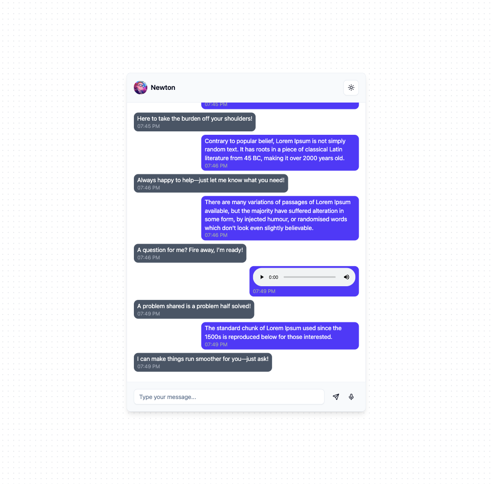
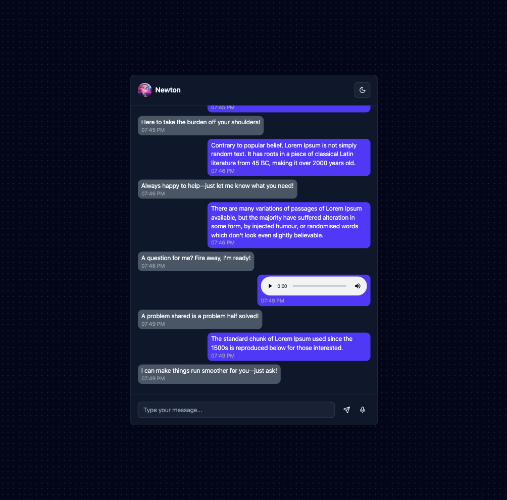
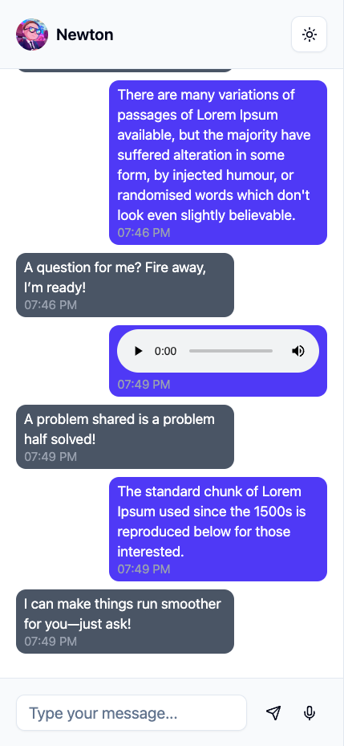
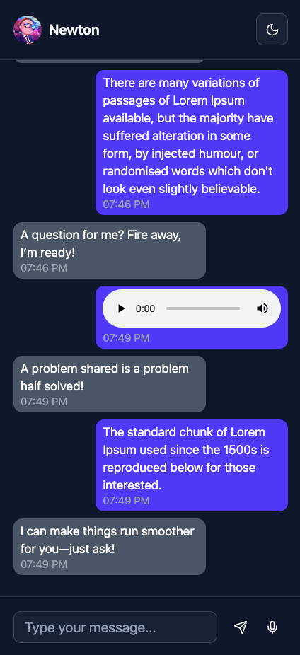

<h1>Chat Bot Experiment</h1>

<p align="center">
  <a href="https://nodejs.org/en/" target="_blank">
    
  </a>
  <a href="https://www.npmjs.com/" target="_blank">
    
  </a>
  <a href="https://react.dev/" target="_blank">
    
  </a>
  <a href="https://www.linkedin.com/in/dominguetigs/" target="_blank">
    
  </a>
</p>

<h3 align="center">
  <a
    href="https://chat-bot-experiment-app-gt62.vercel.app/"
    target="_blank"
  >Access the demo</a>
</h3>

## Table of Contents

- [About](#about)
- [Features](#features)
- [Technologies and libraries](#technologies)
- [Best Practices & Tooling](#best-practices-and-tooling)
- [Project Structure](#project-structure)
- [How to Use](#how-to-use)

<a id="about"></a>

## :bookmark: About

A modern and interactive chat bot application built with React, TypeScript, and Vite. This project features a beautiful UI with animations, dark mode support, and a responsive design.

<a id="features"></a>

## :dart: Features

- Modern and responsive UI
- Dark mode support
- Smooth animations with Framer Motion
- Toast notifications
- Accessible components with Radix UI
- Type-safe development with TypeScript
- State management with Zustand
- Beautiful animations with Lottie
- Code quality tools (ESLint, Prettier, Husky)

<a id="technologies"></a>

## :rocket: Technologies and libraries

The project was developed using the following technologies and libraries:

- [React](https://react.dev/) - A JavaScript library for building user interfaces
- [TypeScript](https://www.typescriptlang.org/) - JavaScript with syntax for types
- [Vite](https://vitejs.dev/) - Next Generation Frontend Tooling
- [Tailwind CSS](https://tailwindcss.com/) - A utility-first CSS framework
- [Radix UI](https://www.radix-ui.com/) - Unstyled, accessible components
- [Framer Motion](https://www.framer.com/motion/) - A production-ready motion library for React
- [Zustand](https://zustand-demo.pmnd.rs/) - A small, fast and scalable state management solution
- [LottieFiles](https://lottiefiles.com/react-web) - Lottie animations for React
- [Sonner](https://sonner.emilkowal.ski/) - Toast notifications

<a id="best-practices-and-tooling"></a>

## :white_check_mark: Best Practices & Tooling

This project follows modern best practices to ensure code quality, consistency, and maintainability:

- [Husky](https://typicode.github.io/husky/get-started.html) Automates pre-commit hooks to enforce standards before pushing changes.
- [ESLint](https://eslint.org/) Ensures consistent code quality by identifying and fixing linting issues.
- [Prettier](https://prettier.io/) Automatically formats code to maintain a uniform style.
- [Commitlint](https://commitlint.js.org/) Enforces a standardized commit message format.
- [Lint-staged](https://github.com/lint-staged/lint-staged) Runs linters on staged files before committing, ensuring only formatted and checked code is pushed.

<a id="project-structure"></a>

## :open_file_folder: Project structure

```
/chat-bot-experiment
├── src/                     # Source files
│   ├── components/          # React components
│   │   ├── chat/            # Chat-related components
│   │   └── ui/              # Reusable UI components
│   ├── constants/           # Application constants
│   ├── hooks/               # Custom React hooks
│   ├── lib/                 # Shared libraries, helpers, and integrations
│   ├── store/               # Zustand store and state management
│   ├── styles/              # Global styles and CSS
│   ├── types/               # TypeScript type definitions
│   ├── utils/               # Utility functions and helper methods
│   ├── App.tsx              # Root application component
│   ├── index.css            # Global CSS styles
│   └── main.tsx             # Application entry point
├── public/                  # Static files
├── components.json          # Radix UI configuration
├── vite.config.ts           # Vite configuration
├── tsconfig.json            # TypeScript configuration
├── package.json             # Project dependencies
└── README.md                # Project documentation
```

## :heavy_check_mark: :computer: Desktop Result

<h1 align="center">
    
    
</h1>

## :heavy_check_mark: :iphone: Mobile Result

<h1 align="center">
    
    
</h1>

<a id="how-to-use"></a>

## :fire: How to use

- ### **Prerequisites**

  - It is **necessary** to have **[Node.js](https://nodejs.org/en/)** installed on the machine in the lts version.
  - Also, you **need** to have a package manager be it **[NPM](https://www.npmjs.com/)** or **[Yarn](https://yarnpkg.com/)**.

1. Clone the repository:

```sh
  $ git clone git@github.com:dominguetigs/chat-bot-experiment.git
```

2. Run the Application:

```sh
  # Install the dependencies
  $ npm install

  # Initialize the application
  $ npm run dev

  # Initialize the application and expose it on your local network IP address
  $ npm run dev:host
```

## :memo: License

This project is under the MIT license. See the [LICENSE](LICENSE.md) file for more details.

---

<h4 align="center">
    Made with 💙 by <a
      href="https://www.linkedin.com/in/dominguetigs/"
      target="_blank"
    >Gustavo Domingueti</a>
</h4>
